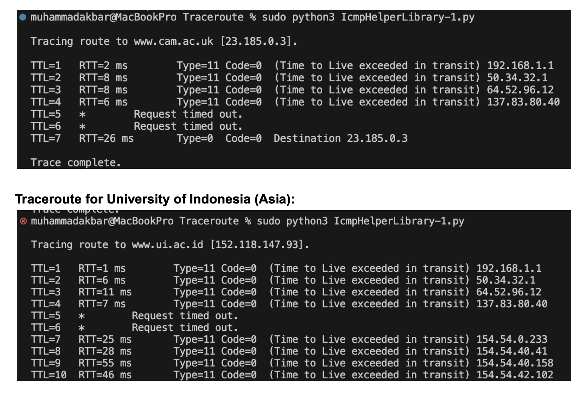

# Summary
There are two main functions. The first is sendPing which allows the program to send out pings,
calculate RTT times and print out summary statistics of these pings. The second is traceRoute
sends a series of ICMP echo requests and prints out information about the response for each
hop. This function allows the user to see the path the packets take from the computer to the
destination host, akin to a traceroute.

To implement these two functions successfully, I have to fulfill the goals of this assignment by
improving the echo reply validation, making detailed output to console with detailed error and
RTT statistics, and integrating traceroute functionality so that the program traces the path to a
destination using incremental TTL values.

# How to run:
To run this program, at least on MacOS, one needs python3 and sudo privileges. There are two
functions. To run sendPing, first input the domain or input address in the following format:
icmpHelperPing.sendPing("put input here").

Put it under the main function definition. Once that is done, open terminal, ensure terminal is in
the same folder as the .py that holds the file, and run sudo python3 _yourFileName_.py.
To run traceRoute, it is the same thing, however the format is the following:
icmpHelperPing.traceRoute("put input here")

# Results:

